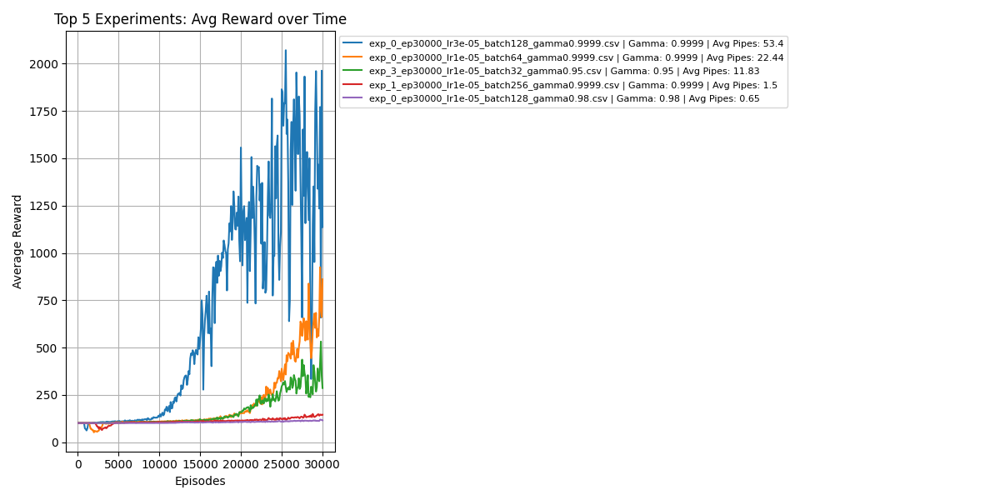

# Flappy Bird Reinforcement Learning with PPO

This project aims to train an agent to play Flappy Bird using a custom-developed reinforcement learning algorithm based on Torch, utilizing the Proximal Policy Optimization (PPO) approach. The agent is trained to maximize its cumulative reward by navigating through pipes while avoiding obstacles.

- [Flappy Bird Reinforcement Learning with PPO](#flappy-bird-reinforcement-learning-with-td3)
  - [Project Structure](#project-structure)
  - [Manual Use](#manual-use)
    - [Training from Scratch](#training-from-scratch)
    - [Testing from Scratch](#testing-from-scratch)
  - [Automated Use](#automated-use)
    - [Training in Batches](#training-in-batches)
  - [Results](#results)
  - [Conclusion](#conclusion)


## Project Structure
```sh
ppo/
├── batch/
│   ├── run_overnight.py    # Run the training and testing overnight in batches.
│   ├── train_myPPO_batch.py            # Batch-based script for training the PPO model.
│   ├── my_ppo.py           # PPO-Agent for the Flappy Bird.
├── evaluate/
│   └── highest-rewards.py             # Show the 5 best results by average values.
│   └── evaluate_models.py             # Run tests and print all results into a csv file
│   └── evaluated_models_md.py         # Convert the csv file from `evaluate_models.py` into markdown compatible table.
│   └── test_best_episode_PPO.py    # Run tests to evaluate performance and visualize the best game at the end. 
│   ├── my_ppo.py           # PPO-Agent for the Flappy Bird.
├── manual/
│   ├── test_myPPO.py                 # Run tests to evaluate performance.
│   ├── train_myPPO.py                # Training script.
│   ├── my_ppo.py           # PPO-Agent for the Flappy Bird.
├── README.md               # Project documentation.
└── requirements.txt        # External Libraries.
```

## Manual Use

> Note: All commands should be exectuted from the root project folder unless otherwise defined. If you execute commands from another folder you might have to update certain paths.

### Training from Scratch
To train the PPO agent from scratch:
1. Install the virtual environment and install all neccessary dependencies:
   ```sh
   py -3.9 -m venv .
   pip install -r src/ppo/requirements.txt
   ```
2. Activate the virtual environment:
   ```sh
   source Scripts/activate
   ```
3. Train the model:
   ```sh
   python src/ppo/train_myPPO.py
   ```
   This will train a PPO agent on the Flappy Bird environment, saving the trained model. You can modify the training parameters (batch size, learning rate, gamma) directly in the script.
4. Monitoring Progress:
   The training process will display the agent's performance in the console, including total reward. The model will be saved as `ppo_flappy.pth` in the working directory.

> Note: Running the training again will overwrite the `ppo_flappy.pth` file.

### Testing from Scratch
Once training is complete, you can manually test the trained model by updating the `test_myPPO.py` file to load the model. 
```python
agent = PPOAgent(obs_dim, act_dim)
agent.load("ppo_flappy.pth")
```
Then, run the script to observe the agent's performance during the test:
```sh
source Script/activate
python src/ppo/test_myPPO.py
```
This will load the trained model and execute it in the Flappy Bird environment, displaying the agent’s performance every 100th episode.

## Automated Use
> **Note**: All commands should be exectuted from the root project folder unless otherwise defined. If you execute commands from another folder you might have to update certain paths.

### Training in Batches

Use:

```python
python src/ppo/batch/run_overnight.py
```

This automates training/testing with various hyperparameters (timesteps, learning rate, batch size, gamma) in one go. It saves each model to `trained_models/` and logs to `experiment_logs/`.

- Iterate through predefined experiment configurations
- Train models with various hyperparameters
- Save model files to `trained_models/`
- Log training metrics to `experiment_logs/`

After training, all models in `trained_models` can be evaluated by running:

```python
python .\src\ppo\evaluate\evaluate_models.py
```

It produces `evaluation_results_ppo.csv`. You can then convert those results into a Markdown table using:

```python
python src/ppo/evaluate/evaluate_models_md.py
```

Which generates `evaluated_models_ppo.md`.

For a quick overview of top-performing experiments, run:

```python
python src/ppo/evaluate/highest_rewards.py
```

This plots the 5 best experiments by average reward, each with different hyperparameters.

## Results


Multiple hyperparameter configurations were tested to analyze their impact on the agent’s performance. The following hyperparameters were adjusted:

- **Episoden**: Different values were tested to determine the optimal number of training iterations.
- **Learning Rates**: Various learning rates were explored to assess their influence on optimization.
- **Batch Sizes**: Different batch sizes were used to evaluate their effect on model updates.
- **Gammas**: Several discount factors were considered to understand their role in future reward calculation.


The following chart shows the average reward received by the agent after testing each model with 100 episodes. It highlights the top 5 experiments, with each line corresponding to a different experiment with varying hyperparameters:




(For a complete view of the results, refer to the full output in [100_episodes_output.md](./results/100_episodes_output.md)).

## Conclusion
This project demonstrates the application of a custom-developed PPO-based reinforcement learning algorithm built with Torch in a classic game environment, Flappy Bird. By experimenting with different hyperparameters, we gain insights into how each factor influences the agent’s performance. The provided scripts allow for easy training, testing, and batch-based automation to explore these effects further.