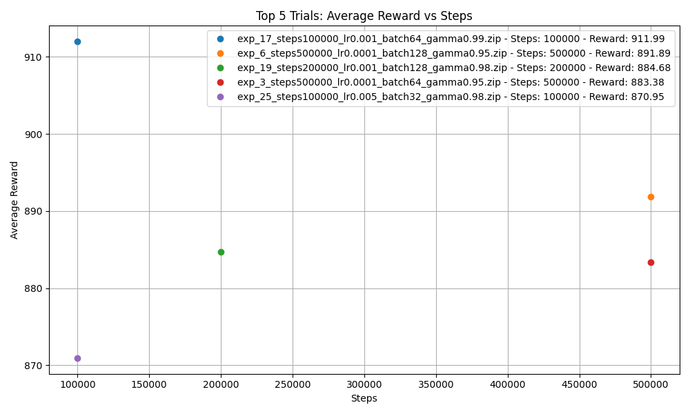

#  PPO-SB: Flappy Bird with Stable-Baselines3 (PPO)

In this subdirectory the **Proximal Policy Optimization (PPO)** is used to train and evaluate agents on the classic **Flappy Bird** game using [Stable-Baselines3](https://github.com/DLR-RM/stable-baselines3) and the `flappy-bird-gym` environment.
- [PPO-SB: Flappy Bird with Stable-Baselines3 (PPO)](#ppo-sb-flappy-bird-with-stable-baselines3-ppo)
  - [Directory Structure](#directory-structure)
  - [Installation](#installation)
  - [Training from Scratch](#training-from-scratch)
    - [Testing from Scratch](#testing-from-scratch)
  - [Automated Use](#automated-use)
    - [Training in Batches](#training-in-batches)
  - [Results](#results)
  - [Conclusion](#conclusion)


---

## Directory Structure

```sh
ppo_sb/
│
├── batch/
│   ├── train.py                  # Train a PPO model with configurable hyperparameters
│   ├── test.py                   # Test a trained PPO model
│   ├── run_overnight.py          # Batch training and evaluation of multiple models
│   ├── run_specific.py           # Batch training and evaluation of specific hyperparameters
├── evaluate/
│   ├── evaluate_models.py        # Evaluate trained models and compute metrics
│   ├── evaluate_models_md.py     # Convert evaluation results into a Markdown table
│   ├── evaluate_with_score.py    # Evaluate trained models and compute metrics with passes pipes
│   ├── highest_rewards.py        # Plot top 5 experiments by average reward
├── manual/
│   ├── train.py                  # Train a PPO model with configurable hyperparameters
│   ├── test.py                   # Test a trained PPO model
```

---
## Installation

1. **Install dependencies** in a virtual environment:

```sh
py -3.9 -m venv .\RL_Project_FlappyBird_Group42\
pip install flappy-bird-gym pandas matplotlib
pip install tensorboard
pip install stable-baselines3
pip install shimmy
```

2. **Activate the virtual environment**:

```sh
# Windows
. Scripts/activate
# Linux
source bin/activate
```

## Training from Scratch

> **Note**: All commands assume you run them from the project’s root folder. If you are in another folder, adjust paths accordingly.

1. **Train the model**:

```python
python src/ppo_sb/train.py
```
  This will train a PPO agent on the Flappy Bird environment, saving the trained model. 

2. **Monitoring progress**:

   During training, the console will log performance metrics like total reward.  
   The model is saved (e.g., `flappybird_ppo_model.zip`).

> **Note**: Running the training again may overwrite the existing `.zip` file unless you change output paths.


### Testing from Scratch

After training completes, you can manually test the model by configuring your test script to load the model:

```python
model = PPO.load("flappybird_ppo_model.zip")
```

Then run:
```sh
python src/ppo_sb/test.py
```

This loads and runs the trained agent in the Flappy Bird environment, logging performance (e.g., total reward, pipes passed) every so many steps or episodes, depending on the script.

---

## Automated Use

> **Note**: Again, ensure you run from the project’s root folder or adjust paths.

### Training in Batches

Use:

```python
python src/ppo_sb/batch/run_overnight.py
```

This automates training/testing with various hyperparameters (timesteps, learning rate, batch size, gamma) in one go. It saves each model to `trained_models/` and logs to `experiment_logs/`.

- Iterate through predefined experiment configurations
- Train models with various hyperparameters
- Save model files to `trained_models/`
- Log training metrics to `experiment_logs/`

After training, all models in `trained_models` can be evaluated by running:

```python
python .\src\ppo_sb\evaluate\evaluate_models.py
```

It produces `evaluation_results_ppo.csv`. You can then convert those results into a Markdown table using:

```python
python src/ppo_sb/batch/evaluate_models_md.py
```

Which generates `evaluated_models_ppo.md`.

For a quick overview of top-performing experiments, run:

```python
python src/ppo_sb/batch/highest_rewards.py
```

This plots the 5 best experiments by average reward, each with different hyperparameters.


## Results

Multiple hyperparameter configurations were tested to understand their effect on the agent’s performance. The following hyperparameters were varied:
- Timesteps: [50000, 100000, 200000, 500000]: The number of timesteps used for training the model.
- Learning Rates: [0.0001, 0.001, 0.005, 0.01]: The learning rate used for the optimizer.
- Batch Sizes: [32, 64, 128, 256]: The batch size used during updates.
- Gammas: [0.95, 0.98, 0.99]: The discount factor used for calculating future rewards.

The following chart shows the average reward received by the agent after testing each model with 100 episodes. It highlights the top 5 experiments, with each line corresponding to a different experiment with varying hyperparameters:


(For a complete view of the results, refer to the full output in [100_episodes_output.md](./results/100_episodes_output.md)).


## Conclusion

This subdirectory demonstrates using **PPO** to train a Flappy Bird agent. By experimenting with hyperparameters, you can see how each parameter impacts performance. The scripts provided make it easy to train, test, evaluate, and automate runs for more in-depth exploration.