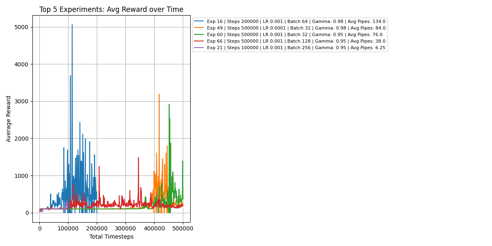

# Flappy Bird Reinforcement Learning with TD3

This project aims to train an agent to play Flappy Bird using the Twin Delayed Deep Deterministic (TD3) algorithm. The agent is trained to maximize its cumulative reward by navigating through pipes while avoiding obstacles.

## Project Structure
```sh
td3/
├── batch/
│   ├── run_overnight.py    # Run the training and testing overnight in batches.
│   ├── train.py            # Batch-based script for training the TD3 model.
│   ├── test.py             # Batch-based script to evaluate the trained model.
│   ├── wrapper.py          # Custom wrapper for the Flappy Bird environment.
├── evaluate/
│   └── highest-rewards.py             # Show the 5 best results by average values.
│   └── evaluate_models.py             # Run tests and print all results into a csv file
│   └── evaluated_models_md.py             # Convert the csv file from `evaluate_models.py` into markdown compatible table.
├── test.py                 # Run tests to evaluate performance.
├── test_best_episode.py                 # Run tests to evaluate performance and visualize the best game at the end. 
├── train.py                # Training script.
├── wrapper.py              # Environment wrapper for Flappy Bird.
└── README.md               # Project documentation.
```

## Manual Use

### Training from Scratch
To train the TD3 agent from scratch:
1. Install the virtual enrinoment and install all neccessary dependencies:
   ```sh
   cd src/td3
   py -3.9 -m venv .
   pip install -r requirements.txt
   ```
2. Activate the virtual environment:
   ```sh
   source Script/activate
   ```
3. Train the model:
   ```sh
   python src/td3/train.py
   ```
   This will train a TD3 agent on the Flappy Bird environment, saving the trained model. You can modify the training parameters (batch size, learning rate, gamma) directly in the script.
4. Monitoring Progress:
   The training process will display the agent's performance in the console, including total reward and other metrics. The model will be saved as `flappybird_td3_model.zip` in the working directory.

> Note: Running the training again will overwrite the `flappybird_td3_model.zip` file.

### Testing from Scratch
Once training is complete, you can manually test the trained model by updating the `test.py` file to load the model. 
```python
model = TD3.load("flappybird_td3_model.zip")
```
Then, run the script to observe the agent's performance during the test:
```sh
source Script/activate
python src/td3/train.py
```
This will load the trained model and execute it in the Flappy Bird environment, displaying the agent’s performance every 100th episode.

## Automated Use
### Training in Batches
To train the agent overnight in batches, use the following command:
   ```sh
   source Script/activate
   python src/td3/batch/run_overnight.py
   ```
This script automates the training and testing process, saving the model after each batch. It allows you to continue training with different parameters overnight without manual intervention. You can modify the batch size, learning rate, and gamma in the `run_overnight.py` script as per your needs.

## Results
Multiple hyperparameter configurations were tested to understand their effect on the agent’s performance. The following hyperparameters were varied:
- Timesteps: [50000, 100000, 200000, 500000]: The number of timesteps used for training the model.
- Learning Rates: [0.0001, 0.001, 0.005, 0.01]: The learning rate used for the optimizer.
- Batch Sizes: [32, 64, 128, 256]: The batch size used during updates.
- Gammas: [0.95, 0.98, 0.99]: The discount factor used for calculating future rewards.

The following chart shows the average reward received by the agent after testing each model with 100 episodes. It highlights the top 5 experiments, with each line corresponding to a different experiment with varying hyperparameters:


(For a complete view of the results, refer to the full output in [100_episodes_output.md](./100_episodes_output.md)).

## Conclusion
This project demonstrates the application of the TD3 reinforcement learning algorithm in a classic game environment, Flappy Bird. By experimenting with different hyperparameters, we gain insights into how each factor influences the agent’s performance. The provided scripts allow for easy training, testing, and batch-based automation to explore these effects further.